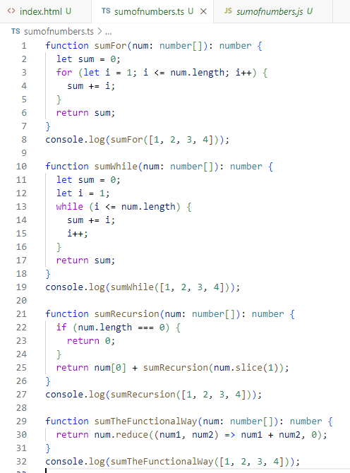

# What Are Coding Standards?
   Coding standards are the guidelines and rules on how developers should write code.  These guidelines are to be followed so that code can be more 
look more uniform and be able to be read by other developers better.  Coding standards consist of spacing and indentations and how the format of the 
code is, it also comprises of what types of variables to use in certain situations and the different types that should be used.  In class not only are we being tested on our code, but we are now being tested on how are code follows these standards.

# What is ESLint
   ESLint is a static code analysis tool that analyzes code to find errors or mistakes in while you are writing it.  We are using this in program in 
our class to write and check our code to see if we are following standards correctly.  We are alerted with red squiggly lines under are code to show 
where we have a problem and where we need to fix.  If we hover over the error the program shows us in a brief sentence what has gone wrong and how we
can fix it, it also has an option where we can use AI to correct it if we are having trouble.  To install ESLint we needed to add the extension and download some files to our folder and then run the command 'npm install' in our terminal to install the program to the folder.  To run ESLint we need to call it through the terminal using the command 'npm run lint' this will run the program and check for any errors if there is any code in the .ts file and will continue to check for errors as you write the code.  To check if the program is running you can create new lines in the code which should provide a newline error, if the error appears that means that ESLint is working and checking.  I enjoy the program and how easy it is to use, the program is really helpful and very instantaneous with showing the errors.  I would like to continue using ESLint throughout my career to always check my errors and make sure that my coding is always within the coding guidelines.

   

# My First Impressions
  I believe coding standards are very important for pormoting neatness and uniformity in your code.  When Using ESLint it made it a lot easier to see
my errors and helped me to present my code a lot nicer than what it was.  When I first started usig ESLint I didn't realize how many coding standard 
errors I had, but after using the program for a week I improved a lot and began getting a lot less errors.  This program helped me learn a lot through fixing my errors and trying not to repeat the same mistakes I used to make before, now when I write my code with ESLint I know what I have done wrong by just looking at the red squiggly error line.  In class we use practice WODS to practice our athletic software engineering by being timed to code a specific task that the professors want us to complete, after all the practice on Thursday we are tested by having to complete and actual WOD where we have to complete the problem before time is done to get credit.  This week we had to use ESLint in our WODS, so we were being tested on not only if we can come up with the solution, but also checking if we can some up with the solution and follow Coding Standards as well.  When I began the WOD I realized that all the practice I was doing helped a lot for me because I did not need to fix many errors which helpeed me finish my WOD with time to spare and my code looked readable and nicely formatted.  Below is a screenshot from one of my practice WODS and a little description on what I had to do to complete it.

   

In this WOD I had to create four functions that return the sum of the numbers in a given list by using a for loop, a while loop, recursion and using Array functional programming naming them sumFor, sumWhile, sumRecursion, and sumTheFunctionalWay.  I also create a console.log that prints each of the results of the functions that should all output 10.  You can see that my code is nicely formatted and uniform with all of the right types and variables.  I completed this practice WOD in 16 minutes with a lot of time to spare.  I had a little trouble with the types where I put let instead of const which ESLint told me to fix, but overall not too many mistakes were made.

# Conclusion
  In conclusion I do believe that coding standards are very important when it comes to neatness in code and uniformity, coding standards also help with readability from peers and helps for better communication when it comes to questions about your code.  Using ESLint helps a lot with fixing problems with code and helps you to follow the guidelines closely, the program helps mold you into a better and neater developer.  I think that all beginners and people jsut learning how to code should use ESLint to fix problems early so that they will become better in the future.

