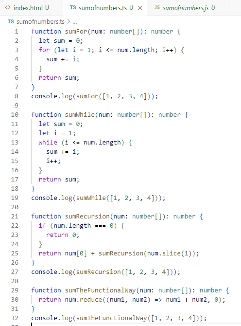

# What Are Coding Standards?
   Coding standards are guidelines and rules on how developers should write code. These guidelines ensure that code looks more uniform and is easier for other developers to read. Coding standards cover aspects such as spacing, indentation, and code formatting. They also specify which types of variables to use in certain situations. In class, we are being tested not only on our code's functionality but also on how well it follows these standards.  I believe that coding standards are one of the most important things to learn when coding because they allow everyone to understand your work. Coding standards should be known throughout the developer community, and all code should be universally consistent.

# What is ESLint
   ESLint is a static code analysis tool that checks your code for errors or mistakes as you write. In our class, we use this program to ensure that our code follows the proper coding standards. When there is an issue, ESLint highlights the problem with red squiggly lines under the code. By hovering over the error, you can see a brief explanation of what went wrong and how to fix it. Additionally, there is an option to use AI to correct the issue if needed.  To install ESLint, we added the extension and downloaded some necessary files to our project folder. We then ran the command npm install in the terminal to install the program into the folder. To use ESLint, we run it through the terminal using the command npm run lint. This checks for any errors in the .ts file and continues to check for mistakes as you write. To verify that ESLint is working, you can create a new line in the code to trigger a newline error. If the error appears, it means ESLint is correctly monitoring your code.  I find ESLint very useful and easy to use. It provides instant feedback on errors, helping me maintain proper coding standards. I plan to continue using ESLint throughout my career to ensure my code consistently follows coding guidelines.
  
     
 
  
# My First Impressions
I believe coding standards are essential for promoting neatness and uniformity in code. Using ESLint made it much easier to spot my errors and helped me present my code more clearly. When I first started using ESLint, I didn’t realize how many coding standard errors I was making. However, after using the program for a week, I improved significantly and started seeing far fewer errors.  This tool taught me a lot by helping me fix my mistakes and avoid repeating them. Now, when I write code with ESLint, I can immediately recognize my mistakes by noticing the red squiggly error lines.  In class, we use practice WODs to train in athletic software engineering by coding specific tasks under timed conditions set by our professors. After practicing on Thursdays, we’re tested by completing an actual WOD where we must solve the problem within the given time to receive credit.  This week, we had to use ESLint in our WODs, meaning we were not only tested on finding the solution but also on following coding standards. During the WOD, I realized that my practice had paid off because I didn’t need to fix many errors, allowing me to finish the WOD with time to spare. My code was also more readable and neatly formatted.  Below is a screenshot from one of my practice WODs, along with a brief description of how I completed it.  
  
     
  
   In this WOD I had to create four functions that return the sum of the numbers in a given list by using a for loop, a while loop, recursion and using Array functional programming naming them sumFor, sumWhile, sumRecursion, and sumTheFunctionalWay.  I also create a console.log that prints each of the results of the functions that should all output 10.  You can see that my code is nicely formatted and uniform with all of the right types and variables.  I completed this practice WOD in 16 minutes with a lot of time to spare.  I had a little trouble with the types where I put let instead of const which ESLint told me to fix, but overall not too many mistakes were made.

# Conclusion
  In conclusion I do believe that coding standards are very important when it comes to neatness in code and uniformity, coding standards also help with readability from peers and helps for better communication when it comes to questions about your code.  Using ESLint helps a lot with fixing problems with code and helps you to follow the guidelines closely, the program helps mold you into a better and neater developer.  I think that all beginners and people jsut learning how to code should use ESLint to fix problems early so that they will become better in the future.

