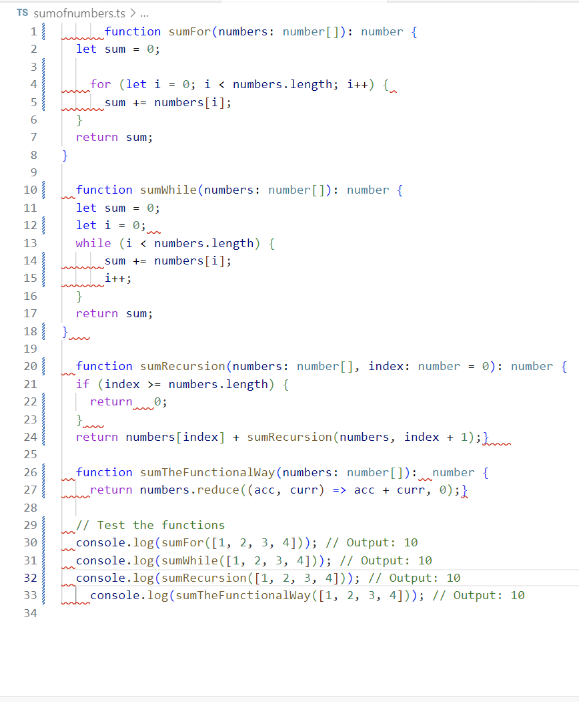
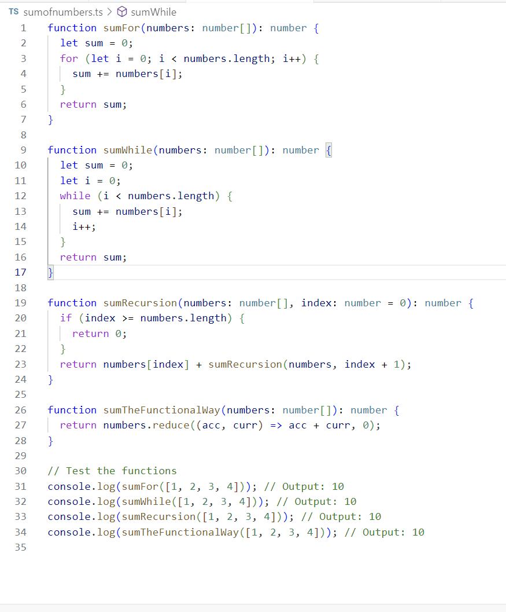

# What Are Coding Standards?
   Coding standards are guidelines and rules on how developers should write code. These guidelines ensure that code looks more uniform and is easier for other developers to read. Coding standards cover aspects such as spacing, indentation, and code formatting. They also specify which types of variables to use in certain situations. In class, we are being tested not only on our code's functionality but also on how well it follows these standards.  I believe that coding standards are one of the most important things to learn when coding because they allow everyone to understand your work. Coding standards should be known throughout the developer community, and all code should be universally consistent.

# What is ESLint
   ESLint is a static code analysis tool that checks your code for errors or mistakes as you write. In our class, we use this program to ensure that our code follows the proper coding standards. When there is an issue, ESLint highlights the problem with red squiggly lines under the code. By hovering over the error, you can see a brief explanation of what went wrong and how to fix it. Additionally, there is an option to use AI to correct the issue if needed.  To install ESLint, we added the extension and downloaded some necessary files to our project folder. We then ran the command npm install in the terminal to install the program into the folder. To use ESLint, we run it through the terminal using the command npm run lint. This checks for any errors in the .ts file and continues to check for mistakes as you write. To verify that ESLint is working, you can create a new line in the code to trigger a newline error. If the error appears, it means ESLint is correctly monitoring your code.  I find ESLint very useful and easy to use. It provides instant feedback on errors, helping me maintain proper coding standards. I plan to continue using ESLint throughout my career to ensure my code consistently follows coding guidelines.
  
     
 
  
# My First Impressions
   I believe coding standards are essential for promoting neatness and uniformity in code. Using ESLint made it much easier to spot my errors and helped me present my code more clearly. When I first started using ESLint, I didn’t realize how many coding standard errors I was making. However, after using the program for a week, I improved significantly and started seeing far fewer errors. This tool taught me a lot by helping me fix my mistakes and avoid repeating them.  Now, when I write code with ESLint, I can immediately recognize my mistakes by noticing the red squiggly error lines.  In class, we use practice WODs to train in athletic software engineering by coding specific tasks under timed conditions set by our professors. After practicing on Thursdays, we’re tested by completing an actual WOD where we must solve the problem within the given time to receive credit.  This week, we had to use ESLint in our WODs, meaning we were not only tested on finding the solution but also on following coding standards. During the WOD, I realized that my practice had paid off because I didn’t need to fix many errors, allowing me to finish the WOD with time to spare. My code was also more readable and neatly formatted.  Below is a screenshot from one of my practice WODs. The screenshot on the left shows code with coding standard errors, while the right shows the corrected version without any errors. You can see how the errors are highlighted through red squiggly lines. 
  
  

    
    

  
   In the practice WOD, I needed to create four functions that return the sum of the numbers in a given list using different methods: a for loop, a while loop, recursion, and Array functional programming. I named these functions sumFor, sumWhile, sumRecursion, and sumTheFunctionalWay.  I also included a console.log statement to output the results of each function, all of which should return 10. You can see that my code is well-formatted and consistent, with the correct use of types and variables throughout.  I completed this practice WOD in 16 minutes, with plenty of time to spare. I encountered a minor issue with types where I used let instead of const, but ESLint pointed out the mistake, and I was able to fix it quickly. Overall, I made very few errors.

# Conclusion
   In conclusion, I believe that coding standards are essential for maintaining neatness and uniformity in code. They also enhance readability for peers and improve communication when discussing code-related questions. Using ESLint is extremely helpful for identifying issues and ensuring that you follow coding guidelines closely. It effectively molds you into a better and more organized developer.  Not only does ESLint help catch syntax and formatting issues, but it also encourages best practices, which is invaluable for long-term project success. By catching errors early and promoting consistency, it saves time in the debugging and collaboration process. As a beginner, using tools like ESLint can significantly reduce the learning curve and make you more efficient.  I think all beginners and those just learning how to code should use ESLint to catch mistakes early, helping them become better developers in the future.

Assistance provided by ChatGPT to help refine Essay

