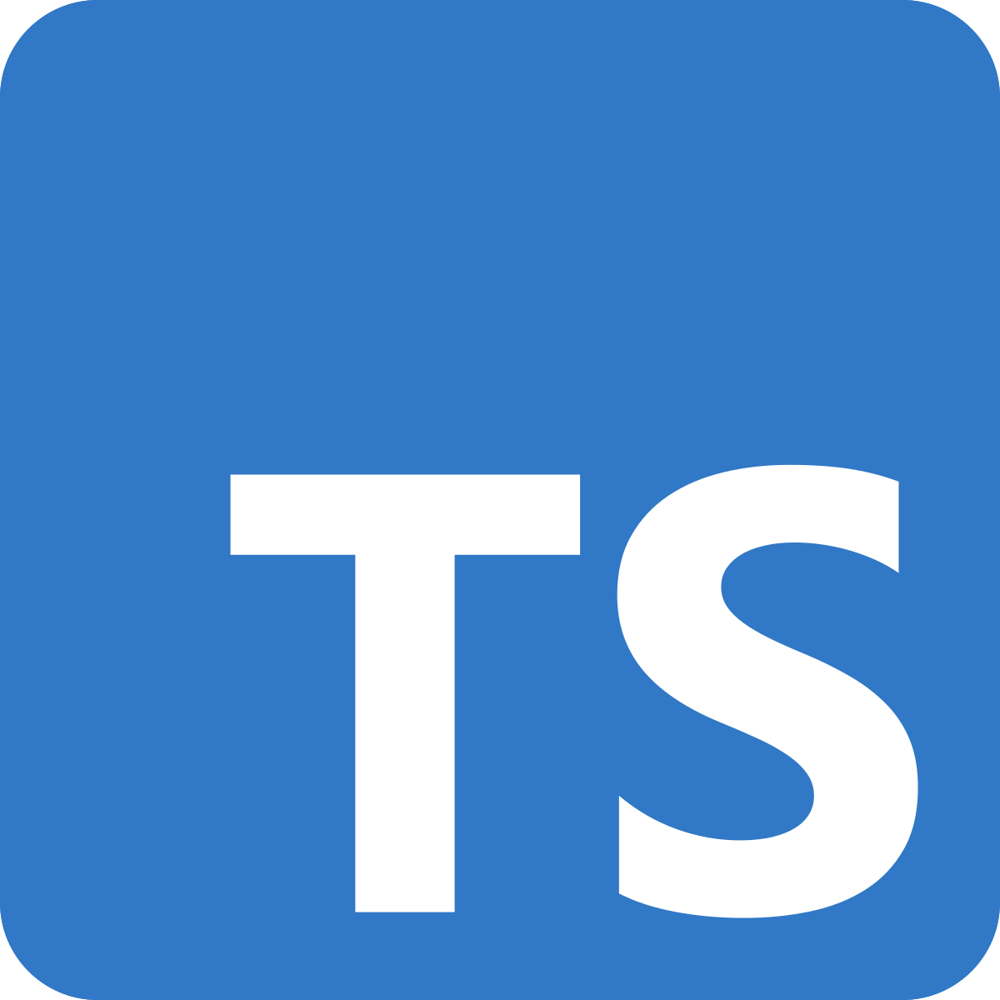

<h1>Reflection on my Experience with Typescript</h1>   

 

# What is Typescript?
   Typescript is basically a superset of Javascript, adding syntax, but not removing anything from Javascript.  Typescript is there to improve on Javascript by allowing developers to use types.  Types help to show what functions need to return and also help to identify the variables and objects at the initialization time.  While writing code, Typescript uses static checking to detect errors in your code before running it.  Typescript will check if specified types match before running the code.  Once you are finished writing your code in typescript language the code will later be compiled into Javascript language and then ran.

# Initial thoughts
   Using Typesscript takes some time to learn, but as I worked through it I began to realize how much of a help it is since I forget at times what I am supposed to be returning in my functions.  This helps me to really understand my code more and to be able to check what is needed before running it.  When working on assignments I was able to figure out problems quickly due to typescript giving me those type errors, which helped me to find what I did wrong quickly.  Using Typescript has made me more aware of what types are and how important it is to understand how they work to avoid having errors in my code.

# Athletic Software Engineering
   In terms of athletic software engineering we use WOD's in class where we are given a problem and have to figure out the coding problem within a set amount of time.  In the beginning it was a bit difficult learning how to code in Typescript, but as I kept practicing I began to catch on.  I was able to be more thorough in my code and really understood what problems I had, helping me increase my speed and efficiency when athletic coding.  I also became successful in my practice WODs and was able to write code fast using TypeScript.  The practice with the WODs really helped me to learn TypeScript and really get to understand how it works more.  I found the process very enjoyable and had fun writing code through the practice WOD.  With time and practice I believe I can work with TypeScript more efficiently and successfully throughout the semester.  Below is an example of the practice WODs that we do for class.

     

