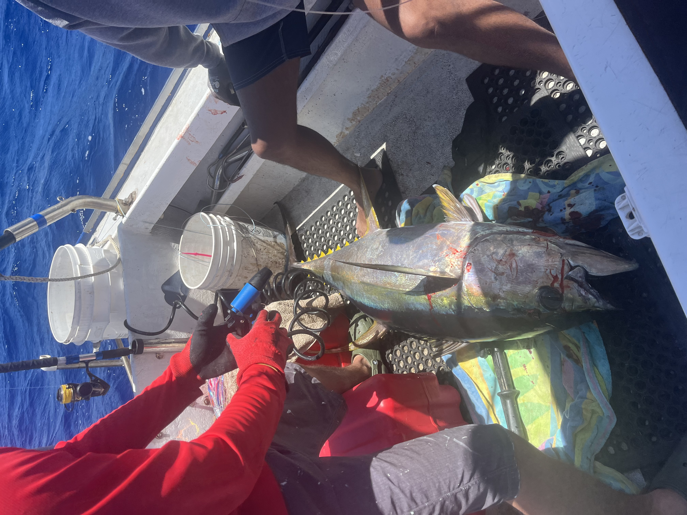
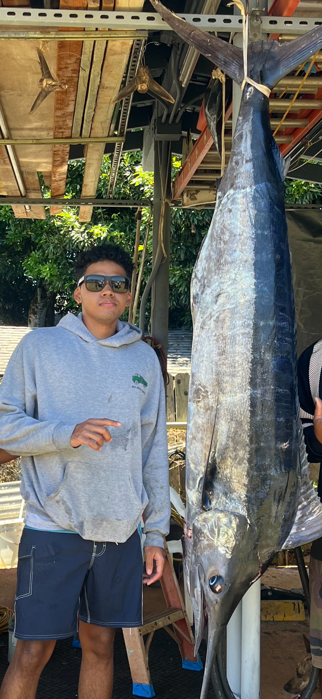

#Introduction

   Years ago I was terrible at fishing, not knowing anything about tying lines or what fish were what.  I always needed help from others to try to catch a fish and was very unseccessful in every trip I went on.  I really like to eat fish so I made it my project on trying to catch fish and learning everything I can to become better.  This is my process on my journey on becoming fairly successful.

#Conditions

   I always heard that fishing conditions factor in on how successful your day can be when out fishing, I began learning what seasons were best for different types of fish, what areas certain fish like, what time of day they usually come out to feed, even how the moon phase affects aggression of certain fish.  Learning these conditions helped me to really locate 

#Boat Fishing

   My friend bought a boat a couple years ago and I began going out with him, we went on many fishing trips together ending our trips unsuccessful all the time.  I began to study pelagic fish (Deep ocean fish: ex. Tuna) I realized that these fish usually bite better around full moons and dark moons and usually bite better early in the morning.  I also learned how bird piles out on the ocean can help us find where these fish gather in schools.  Learning these things we switched up our style and began to leave earlier in the morning, started looking for bird piles, also changing our lures and hooks to the ones that we learned had more bites, with all of the changes we started to be more successful.  We entered a small tournament and ended up getting third.  With more learning we got second and began catching more and more fish and were successful on every trip that we went on.

#Photos

  
  
  

