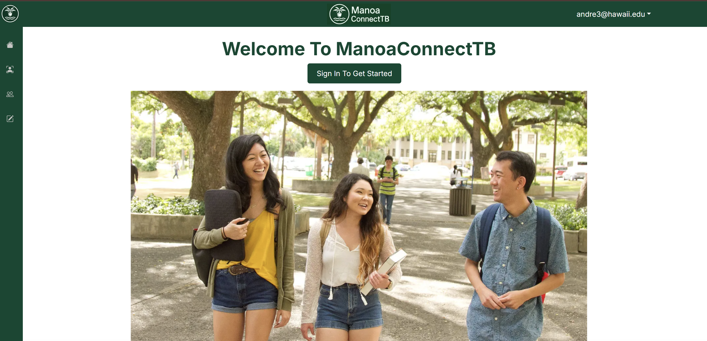
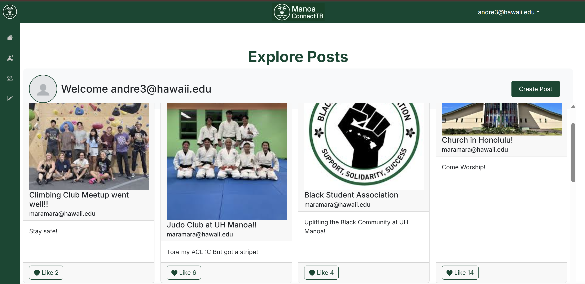
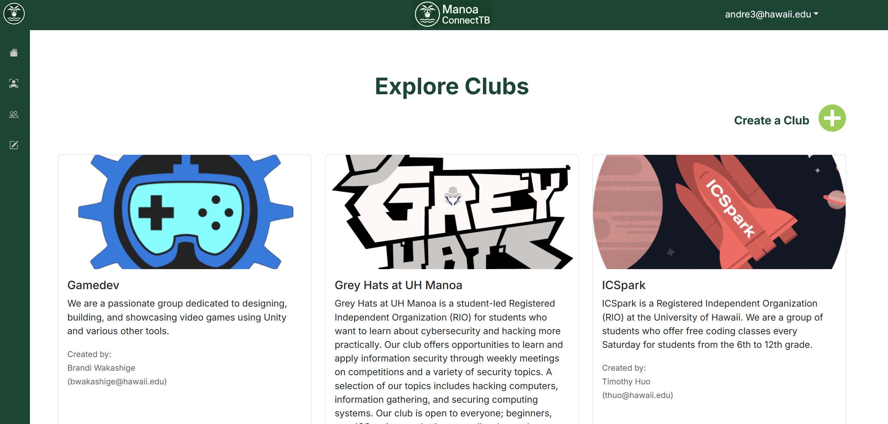

# Introduction

   Throughout this semester, we worked on various aspects of web development, using tools like GitHub, VSCode, and ESLint to prepare for this final project. The result of our efforts is showcased here. You can view our project’s Home Page <a href="https://manoaconnecttb.github.io/">here</a> , which outlines our planning process, the purpose of the website, and updates made along the way. If you'd like to explore the live site, you can visit it <a href="https://manoa-connect.vercel.app/">here</a>

# Photos

  
  
  

# Summary
   
   Working through this project taught me a lot about myself and how to collaborate effectively with others. I gained a solid understanding of project management and learned how to push, pull, and merge changes into the main branch. Although I encountered challenges and made mistakes along the way, each one was a valuable learning experience. Overall, this was an amazing journey, and I am truly proud of the final result we achieved.
